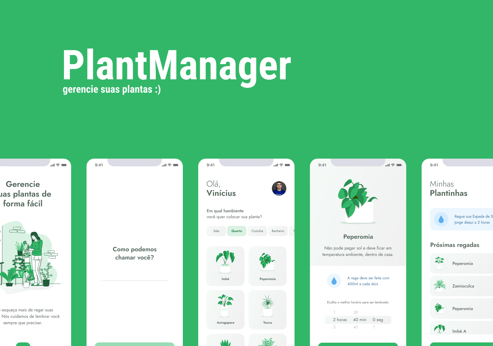

<h1 align="center">
    
</h1>

<p align="center">
  <a href="#-technologies">Technologies</a>&nbsp;&nbsp;&nbsp;|&nbsp;&nbsp;&nbsp;
  <a href="#-requeriments">Requeriments</a>&nbsp;&nbsp;&nbsp;|&nbsp;&nbsp;&nbsp;
   <a href="#-to-execute-the-project">Getting started</a>&nbsp;&nbsp;&nbsp;
</p>

<br>

<p align="center">
  
</p>

---

## 🧪 Technologies

This project was developed using the following technologies:

- [React Native](https://reactnative.dev/)
- [Expo](https://expo.io/)
- [TypeScript](https://www.typescriptlang.org/)

## ✅ About

The project aims to facilitate the management of your plants. Remembering you when you water and also the best ways to take care of your plants. Using libraries and APIs such as Asyncstorage, Datetimepicker, Axios, JSON-Server, React Hooks and more. 

## 🟢 Requirements

- [x] Yarn
- [x] Node.js
- [x] Npm
- [x] Expo
- [x] JSON-SERVER

## 🚀 To execute the project

Clone the project and access the folder

```bash
$ git clone https://github.com/viniciuspetrachin/plantmanager-react-native.git
& cd plantmanager-react-native
$ yarn install
$ expo start
# IN ANOTHER BASH
$ cd plantmanager-react-native && json-server ./src/services/server.json --host 192.168.15.4 --port 3333 --delay 815
# AFTER THAT RUN EXPO IN YOUR DEVICE
```
You need JSON Server to be able to emulate the database.
